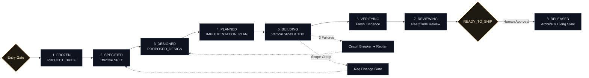

<p align="center">
  
</p>

<p align="center">
  <strong>A lifecycle orchestrator for reliable AI-assisted software engineering.</strong><br>
  <em>From vibe coding to engineered delivery.</em>
</p>

<p align="center">
  <a href="LICENSE"></a>
  <a href="docs/CONSTITUTION.md"></a>
  <a href="tests/results/v0.1.md"></a>
  <a href="#multi-agent-compatibility"></a>
</p>

<p align="center">
  <a href="#-quick-start">Quick Start</a> •
  <a href="#-the-paradigm-shift">Why Vibe Workflow</a> •
  <a href="#-multi-agent-compatibility">Compatibility</a> •
  <a href="docs/CONSTITUTION.md">Constitution</a> •
  <a href="README.zh-CN.md">简体中文</a>
</p>

---

## 💡 What is Vibe Workflow?

AI coding agents can generate hundreds of lines of code in seconds. However, when deployed on **multi-step, multi-session software projects**, they inevitably derail:

- **Scope Creep**: A casual prompt causes the agent to silently alter database schemas or delete core constraints.
- **Context Drift**: In a new session, the agent hallucinates past decisions and starts overwriting working code.
- **Retry Doom-Loops**: The agent patches the same failing test 5 times, breaking adjacent modules and compounding technical debt.
- **False Completion**: The agent confidently claims `DONE! Everything is tested`, without running a single build command.

**Vibe Workflow is an engineering lifecycle orchestrator.**  
It does not teach an LLM how to write a function; it provides the **state machine, gates, and repository discipline** that ensure an agent delivers verifiable, production-grade software over days and weeks.

> 🎯 **Core Division of Responsibility**:  
> **Grill Me** clarifies *what* to build.  
> **Vibe Workflow** reliably orchestrates *how* it gets built and verified.

---

## 🎭 The Paradigm Shift

| Failure Mode | Without Vibe Workflow | With Vibe Workflow |
| :--- | :--- | :--- |
| **Vague Rush Requests** | Agent guesses missing specs, generates throwaway code. | **Entry Gate Trips**: Halts execution until requirements are `FROZEN`. |
| **Mid-flight Scope Changes** | Agent silently hacks in features, breaking existing architecture. | **Requirement Change Gate**: Halts work, isolates impact, requires human approval. |
| **Repeated Failures** | Agent blind-patches until codebase collapses. | **Circuit Breaker**: Halts at 3 failures, snapshots state, and forces replanning. |
| **Completion Claims** | "All done!" (Code looks plausible, build is broken). | **Evidence Gate**: Strict rejection of "Done" without fresh passing test logs. |
| **Memory Across Sessions** | Relies on fading chat history; hallucinates past state. | **Repository as Memory**: Rehydrates exclusively from Git and living docs. |

---

## ⚡ Five Core Engineering Pillars

1. **Requirements Freeze & Entry Gates**: Engineering never begins on ambiguous intent. Four observable conditions are required: `Requirement Status == FROZEN`, `Open Questions == None`, `Release ID exists`, and `Acceptance Goals are testable`.
2. **Repository is Memory, Chat is Conversation**: Chat context is transient. The repository (Git commits, tests, and `docs/vibe/`) is the single durable source of truth.
3. **Decoupled Verification & Shipping Gates**: Human risk acceptance can authorize a deployment, but it **cannot** convert missing test evidence into `VERIFIED` or `READY_TO_SHIP`. Facts and permissions remain strictly separate.
4. **Circuit Breaker (Zero Retry Loops)**: When an agent encounters 3 consecutive failures, cascades regressions, or disproves core assumptions, it must:
   ```text
   STOP PATCHING
     → Preserve last known good state
     → Capture Debug Snapshot in PROGRESS.md
     → Set Operational Status = REPLAN_REQUIRED
     → Replan in a clean context window
   ```
5. **Context Governor (Attention Shield)**: Prevents context window poisoning by injecting only the *Minimal Sufficient Context* (Task Context Pack) and excluding historical releases and massive git logs.

---

## 🔄 High-Level Lifecycle



*For complete transition contracts, state definitions, and rollback rules, see [Lifecycle Specification](docs/concepts/lifecycle.md).*

---

## 🧩 Ecosystem Role Matrix

Vibe Workflow is an orchestrator, not a monolithic framework. It delegates specialized engineering phases to purpose-built tools:

| Tool | Core Responsibility | When Active |
|---|---|---|
| **[Grill Me](https://github.com/sz-xiaohuolong/vibe-workflow)** | Interactive requirement elicitation | Prior to Requirement Freeze |
| **Vibe Workflow** ⭐ | **Lifecycle state, decision gates, context governor, evidence verification** | **Throughout the entire project** |
| **[Superpowers](https://github.com/obra/superpowers)** | Specialized execution (TDD, Systematic Debugging, Worktrees) | Invoked during Build & Debug stages |
| **Coding Agent** (Codex/Claude) | Code generation and tool execution | Delegated task execution |

---

## 🚀 Quick Start

### 1. Installation

Install via the cross-agent CLI standard:

```bash
# Recommended for Claude Code, Cursor, and modern agents
npx skills add sz-xiaohuolong/vibe-workflow
```

Or clone and run the unified repository installer:

```bash
git clone https://github.com/sz-xiaohuolong/vibe-workflow.git
cd vibe-workflow
./install.sh
```

### 2. Common Workflows

#### Start a New Project
```text
$vibe-workflow Check the Entry Gate and initialize Release v0.1 from our frozen requirements.
```

#### Resume Across Sessions
```text
$vibe-workflow Resume current project from repository facts and verify the next pending task.
```

#### Handle a Mid-Flight Scope Change
```text
$vibe-workflow Assess the impact of adding user avatars, draft a Change Proposal, and halt affected building.
```

---

## 🔌 Multi-Agent Compatibility

Vibe Workflow follows the open `SKILL.md` specification ([agentskills.io](https://agentskills.io/)).

| Agent / Environment | Support Tier | Installation Path / Method | Verification Status |
| :--- | :--- | :--- | :--- |
| **OpenAI Codex** | **Native Skill** | `./install.sh codex` or in-chat `$skill-installer` | ✅ **Verified** |
| **Claude Code** | **Native Skill** | `npx skills add sz-xiaohuolong/vibe-workflow` or `./install.sh claude` | ✅ **Verified** |
| **Antigravity / Gemini CLI** | **Native Skill** | `~/.gemini/config/skills/` or `./install.sh gemini` | ✅ **Verified** |
| **Cursor** | **Rule Adapter** | `./install.sh cursor` (`.cursor/rules/vibe-workflow.mdc`) | 📝 Documented |
| **Windsurf** | **Rule Adapter** | `.windsurfrules` (via `adapters/windsurf/`) | 📝 Documented |
| **Cline / Roo Code** | **Rule Adapter** | `.clinerules` (via `adapters/cline/`) | 📝 Documented |
| **OpenCode** | **Native Skill** | Standard `SKILL.md` directory mounting | 📝 Documented |

*See [Installation Guides](docs/installation/) for platform-specific setup.*

---

## ⚖️ When to Use vs. When NOT to Use

### ✅ Use Vibe Workflow When:
- Projects span multiple sessions, PRs, or releases.
- Requirements must remain strictly bounded against agent creep.
- You need high-stakes gates before database migrations, security changes, or deployments.
- You want auditable, evidence-backed proof before declaring completion.

### ❌ You Do NOT Need It When:
- You are tweaking a single line of CSS or copy (**Tiny tasks bypass documentation**).
- You are writing a one-off throwaway prototype script.
- You are running open-ended exploratory chat queries.

---

## 🛡️ Trust & Verification

Vibe Workflow was built and validated using **Skill TDD**:
- **25 Adversarial Scenarios**: Subjected to pressure testing (rushed demos, cascading failures, unauthorized schema edits, and fake completion claims).
- **Dual-Blind Microtests**: Rigorously benchmarked with Control (no skill) vs. Candidate evaluations.
- **Evidence-Backed**: Inspect our reproducible test scripts and logs in [`tests/results/v0.1.md`](tests/results/v0.1.md) and [`tests/scenarios.md`](tests/scenarios.md).

Run static compliance checks locally:
```bash
./tests/validate_skill.sh
```

---

## 📚 Deep Dive Documentation

- [The Engineering Constitution](docs/CONSTITUTION.md) — The 10 inviolable rules.
- [Lifecycle & State Machine](docs/concepts/lifecycle.md) — State transitions, entry conditions, and rewinds.
- [Human Decision Gates & Schema Protocol](docs/concepts/decision-gates.md) — The 5-step migration rules and risk tags.
- [Circuit Breaker & Recovery](docs/concepts/circuit-breaker.md) — Tripping criteria and Debug Snapshots.
- [Context Governor](docs/concepts/context-governor.md) — The three context packs and exclusion policies.
- [Artifact Model & Traceability](docs/concepts/artifacts.md) — Living documents vs. archived releases.

---

## 🤝 Contributing & License

Contributions are welcome! Please review [CONTRIBUTING.md](CONTRIBUTING.md) before submitting behavioral modifications.  
Distributed under the [MIT License](LICENSE).
