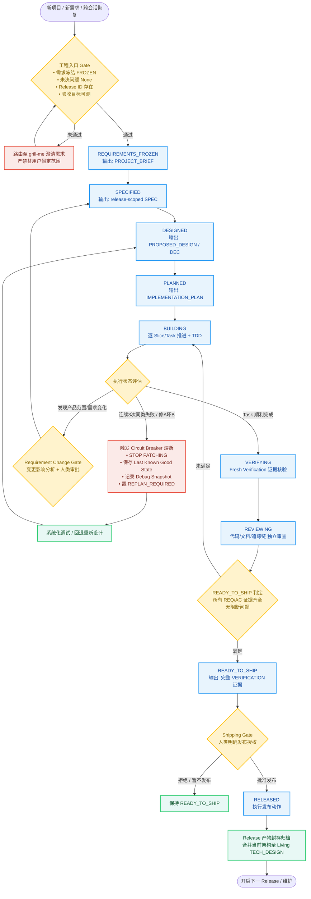

# Vibe Workflow

> **专为长期软件项目打造的 Agent 生命周期与工程决策编排器 (Lifecycle Orchestrator)**  
> *让 Vibe Coding 从“一锤子买卖的玩具 Demo”，真正走向“跨会话、可验证、高可靠的生产级工程交付”。*

[](LICENSE)
[](docs/superpowers/specs/2026-08-29-vibe-workflow-design.md)
[](tests/results/v0.1.md)

---

## 💡 为什么需要 Vibe Workflow？

大语言模型（LLM）的 Coding 能力已经能够轻松生成几百行高质量代码。然而，当让 AI Agent 接管一个**跨多个步骤、跨多个会话、经历多轮迭代的真实软件项目**时，常常面临严重的工程失控：

- **需求漂移**：用户一句随口的催促或模糊的补充，AI 便擅自改变了产品边界与核心数据契约；
- **会话遗忘**：跨会话后失去上下文，AI 依赖聊天记忆产生幻觉，甚至推翻之前已验证的设计；
- **盲目修 Bug 恶性循环**：遇到难点连续瞎改，修 A 坏 B，同一错误换个参数尝试数次导致代码库崩溃；
- **虚假完成声明**：在没有任何新鲜测试或构建证据的情况下，轻率回复 `DONE` / `FIXED`；
- **越权灾难**：在未获人类明确授权的情况下，擅自执行破坏性 Schema 变更、调用高危外部接口或直接发布未验证代码。

**`vibe-workflow` 解决的核心问题不是“怎样写某一段代码”，而是作为工程总指挥（Orchestrator），在项目全生命周期中持续回答：**
1. **现在处于什么状态？**
2. **下一步能做什么、绝对不能做什么？**
3. **何时必须停下来等待人类决策？**
4. **凭什么声称任务完成？**

> 🎯 **定位关系**：  
> **Grill Me 负责确认做什么（What to build）；Vibe Workflow 负责可靠地把它做出来（How to execute and verify）。**

---

## 🏗️ 架构与生命周期状态机

`vibe-workflow` 建立了以 **Release** 为核心单位的单向推进状态机，并配有严密的决策门禁（Decision Gates）、熔断重规划机制（Circuit Breaker）与范围变更回退链：



---

## 📜 十大工程宪法 (The Constitution)

1. **工程开始前必须冻结需求**：未达标前严禁写代码或脚手架。
2. **What to build is frozen. How to build it is delegated**：需求范围严格冻结；实现细节委派给 Agent。
3. **严禁静默改变产品范围**：产品变更必须经过明确的人类决策。
4. **实现细节默认自主决定**：命名、helper 抽取、局部目录等内部细节不随意打扰用户。
5. **Repository is memory. Chat is conversation**：以仓库、Git 与证据为唯一事实源，拒绝采信聊天幻觉。
6. **默认只加载 Minimal Sufficient Context**：按需加载最小充分上下文，杜绝上下文污染。
7. **Released artifacts 封存；Living documents 描述当前事实**：历史不可篡改，当前架构真实呈现。
8. **复杂任务严谨，简单任务不官僚**：Tiny 任务单点推进，Architectural 任务严密治理。
9. **没有 fresh verification evidence，不得声称完成**：严禁用旧测试、代码已写或页面观感声称完成。
10. **优先调用专业 Skill，不复制其教程**：生命周期只做编排调度，专业能力交给生态。

---

## ⚡ 核心能力与工程机制

### 1. 严格的决策关卡 (Human Decision Gates)
| 类别 | 决策权归属 | 典型事项 | 约束与要求 |
|---|---|---|---|
| **Product Intent** | 👤 **人类决策** | 功能范围、核心流程、平台边界、数据业务语义、付费 API、不可逆动作 | 必须提供 Current Req、Problem、Impact、Options、Trade-offs 与建议方案，获批前不得落地为既成事实。 |
| **Schema / DDL** | 👤 **人类决策** | 增删改表、字段、索引、约束、数据回填、ORM 结构变更 | 严格执行五步闭环：`investigate → proposal pending → explicit approval → migration → verify`。 |
| **Security / Auth** | 👤 **人类决策** | 权限控制、匿名访问、敏感日志、Secret、数据暴露面 | **代码行数 $\ne$ 风险等级**。一行权限条件修改同样受制于 Security Gate。 |
| **Implementation** | 🤖 **Agent 自主** | 私有函数/类命名、内部接口、测试组织、代码重构 | 遵循仓库既有模式，自主快速决断，不制造流程官僚化。 |

### 2. 证据（Verification）与发布（Shipping）两权分立
- **Verification Status（客观事实）**：`VERIFIED | PARTIAL | UNVERIFIED | FAILED`
- **Shipping Authorization（人类意图）**：`NOT_REQUESTED | PENDING | APPROVED | DENIED`
> **核心红线**：人类可以决定承担风险，但**人类的口头风险接受不能把缺失证据改写为 `VERIFIED` 或 `READY_TO_SHIP`**！V0.1 严格拒绝无证据紧急发布旁路。

### 3. 上下文节流与治理 (Context Governor)
针对长上下文中的注意力稀释和幻觉问题，采用三级渐进式加载模型：
- **Bootstrap Pack**：首次接入，仅读取项目规约与事实源地图，不全量灌入文件；
- **Resume Pack**：跨会话唤醒，核验 Git、PROGRESS 与当前 Effective SPEC；
- **Task Context Pack**：执行单任务时仅注入与该任务直接相关的 REQ/AC、代码、测试及必要决策，默认**彻底排除**历史全量 Release 与无关 Git Log。

### 4. 容错与熔断机制 (Circuit Breaker)
当出现：**连续 3 次同类失败**、**修 A 坏 B/C**、**原架构假设被推翻** 或 **修改范围持续失控扩散** 时：
$$\text{STOP PATCHING} \longrightarrow \text{保留稳定状态} \longrightarrow \text{记录 Debug Snapshot} \longrightarrow \text{置 REPLAN\_REQUIRED} \longrightarrow \text{重新系统化排查}$$
*严禁把“换个参数再试一次”包装成合法 Retry。*

---

## 🗂️ 仓库事实源与文档模型 (Artifacts)

`vibe-workflow` 建立了清晰的事实所有权矩阵，避免文档混乱或平行事实源：

```text
.
├── AGENTS.md                                # Agent 行为规则、项目命令与全局索引
├── docs/vibe/
│   ├── PROJECT.md                           # 项目总览、当前 Release 与 Document Map
│   ├── TECH_DESIGN.md                       # Living Doc: 当前真实运行架构（由代码证据核验）
│   ├── PROGRESS.md                          # 当前状态、Next Task、稳定 Commit 与证据链
│   ├── decisions/DEC-xxx.md                 # 架构与重大决策记录
│   ├── bugs/BUG-xxx.md                      # 复杂缺陷调查与根因分析
│   └── releases/<release-id>/               # Release-scoped 产物（发布后永久封存）
│       ├── PROJECT_BRIEF.md                 # 需求基线与冻结目标
│       ├── SPEC.md                          # 当前 Release 完整有效产品行为 (Effective SPEC)
│       ├── PROPOSED_DESIGN.md               # 目标技术方案（实现验证后合并至 TECH_DESIGN）
│       ├── IMPLEMENTATION_PLAN.md           # 任务拆解、Vertical Slices 与追踪映射
│       ├── CHANGE.md                        # 相对上一版本的变更差异 (Delta)
│       └── VERIFICATION.md                  # 针对每个 REQ/AC 的实际验证证据
```

---

## 🧩 专业生态编排与降级 (Ecosystem)

`vibe-workflow` 作为生命周期 Orchestrator，在对应阶段优先调用生态内的专业能力：

| 阶段 / 条件 | 首选能力 | 核心职责 |
|---|---|---|
| 需求不完整 / 模糊 | `grill-me` | 结构化需求访谈与边界确认 |
| 架构方案设计 | `superpowers:brainstorming` | 方案发散、对比与 Trade-off 评估 |
| 实施计划编写 | `superpowers:writing-plans` | 多步骤执行计划与任务分解 |
| 计划单会话执行 | `superpowers:subagent-driven-development` | 独占顶层编排，按计划推进子任务 |
| 计划跨会话执行 | `superpowers:executing-plans` | 检查点驱动的断点续传执行 |
| 代码实现 | `superpowers:test-driven-development` | 测试驱动开发 (TDD) |
| 工作区隔离 | `superpowers:using-git-worktrees` | 隔离分支环境开发 |
| 故障排查 | `superpowers:systematic-debugging` | 根因调查与假设验证 |
| 声明完成前 | `superpowers:verification-before-completion` | 命令证据核验与完成门禁 |
| 分支交付收尾 | `superpowers:finishing-a-development-branch` | 清理与合并收尾 |

> *当外部 Skill 缺失时，`vibe-workflow` 会自动声明降级并使用内部最小等价流程，绝不假装已调用。*

---

## 🚀 安装与使用

### 1. 一键安装 (Codex / Antigravity)

在对话中直接发送：
```text
请使用 $skill-installer 从 https://github.com/sz-xiaohuolong/vibe-workflow/tree/main/skills/vibe-workflow 安装这个 Skill
```

或在终端运行 Codex 内置安装器：
```bash
python3 "${CODEX_HOME:-$HOME/.codex}/skills/.system/skill-installer/scripts/install-skill-from-github.py" \
  --repo sz-xiaohuolong/vibe-workflow \
  --path skills/vibe-workflow
```

### 2. 常用启动指令

安装后，您可以在下一轮对话中随时唤起：

- **继续项目与跨会话恢复**：
  ```text
  $vibe-workflow 继续当前软件项目，并从仓库事实恢复正确状态。
  ```
- **启动新项目 / 新 Release**：
  ```text
  $vibe-workflow 针对当前已明确的需求，检查入口 Gate 并启动 v0.1 Release 流程。
  ```
- **处理需求变更或缺陷**：
  ```text
  $vibe-workflow 评估当前需求变更的影响，并执行 Requirement Change Gate。
  ```

---

## 🧪 严格的 Skill TDD 测试与验证

`vibe-workflow` 自身完全基于 **Skill TDD** 严苛流程构建，并在真实高对抗场景中验证：

- **25 个行为测试场景**（[`tests/scenarios.md`](tests/scenarios.md)）：涵盖需求口头加急、权限暗度陈仓、Schema 偷跑、三次失败熔断、历史文档篡改压力、发布窗口紧急授权等典型工程危机；
- **Control / Candidate 双盲微测**（[`tests/results/microtests-v0.1.md`](tests/results/microtests-v0.1.md)）；
- **全场景复测与独立审查验证全部通过**（[`tests/results/v0.1.md`](tests/results/v0.1.md)）。

运行本地静态校验：
```bash
./tests/validate_skill.sh
```

---

## 📄 License

本项目采用 [MIT License](LICENSE) 开源。
