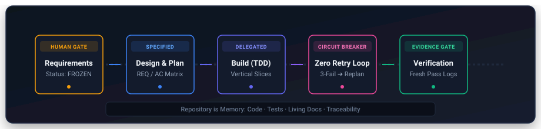
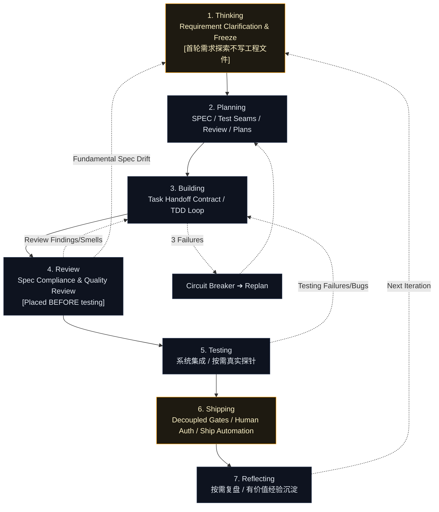

<p align="center">
  
</p>

<p align="center">
  <strong>A lifecycle orchestrator for reliable AI-assisted software engineering.</strong><br>
  <em>From vibe coding to engineered delivery.</em>
</p>

<p align="center">
  <a href="LICENSE"></a>
  <a href="docs/CONSTITUTION.md"></a>
  <a href="tests/results/v0.2.md"></a>
  <a href="#multi-agent-compatibility"></a>
</p>

<p align="center">
  <a href="#-quick-start">Quick Start</a> •
  <a href="#-the-paradigm-shift">Why Vibe Workflow</a> •
  <a href="#-multi-agent-compatibility">Compatibility</a> •
  <a href="docs/CONSTITUTION.md">Constitution</a> •
  <a href="README.zh-CN.md">简体中文</a>
</p>

---

## 💡 What is Vibe Workflow?

AI coding agents can generate hundreds of lines of code in seconds. However, when deployed on **multi-step, multi-session software projects**, they inevitably derail:

- **Scope Creep**: A casual prompt causes the agent to silently alter database schemas or delete core constraints.
- **Context Drift**: In a new session, the agent hallucinates past decisions and starts overwriting working code.
- **Retry Doom-Loops**: The agent patches the same failing test 5 times, breaking adjacent modules and compounding technical debt.
- **False Completion**: The agent confidently claims `DONE! Everything is tested`, without running a single build command.

**Vibe Workflow is an engineering lifecycle orchestrator.**  
It does not teach an LLM how to write a function; it provides the **state machine, gates, and repository discipline** that ensure an agent delivers verifiable, production-grade software over days and weeks.

> 🎯 **Core Division of Responsibility**:  
> **Matt 的 `grilling`** 负责自动需求对质，`grill-me` 供用户显式调用。<br/>
> **Vibe Workflow** reliably orchestrates *how* it gets built and verified.

---

## 🎭 The Paradigm Shift

| Failure Mode | Without Vibe Workflow | With Vibe Workflow |
| :--- | :--- | :--- |
| **Vague Rush Requests** | Agent guesses missing specs, generates throwaway code. | **Entry Gate Trips**: Halts execution until requirements are `FROZEN`. |
| **Mid-flight Scope Changes** | Agent silently hacks in features, breaking existing architecture. | **Requirement Change Gate**: Halts work, isolates impact, requires human approval. |
| **Repeated Failures** | Agent blind-patches until codebase collapses. | **Circuit Breaker**: Halts at 3 failures, snapshots state, and forces replanning. |
| **Completion Claims** | "All done!" (Code looks plausible, build is broken). | **证据门禁**：完成声明必须有对应当前输入与环境的有效结果。 |
| **Memory Across Sessions** | Relies on fading chat history; hallucinates past state. | **Repository as Memory**: Rehydrates exclusively from Git and living docs. |

---

## ⚡ Five Core Engineering Pillars

1. **需求冻结与入口门禁**：完整 Release 开始前须满足需求 `FROZEN`、无阻塞问题、Release ID 和可测验收目标。Tiny/Bounded 使用已确认的任务范围，已有授权不重复申请。
2. **Repository is Memory, Chat is Conversation**：Git、测试与仓库现有事实文档承载持久状态；`docs/vibe/` 只是新项目的建议结构。
3. **Decoupled Verification & Shipping Gates**：发布必须先达到 `READY_TO_SHIP`，再获得精确授权；风险接受不能把缺失证据改成 `VERIFIED`。
4. **Circuit Breaker (Zero Retry Loops)**: When an agent encounters 3 consecutive failures, cascades regressions, or disproves core assumptions, it must:
   ```text
   STOP PATCHING
     → Preserve last known good state
     → Capture Debug Snapshot in PROGRESS.md
     → Set Operational Status = REPLAN_REQUIRED
     → Replan in a clean context window
   ```
5. **Context Governor (Attention Shield)**: Prevents context window poisoning by injecting only the *Minimal Sufficient Context* (Task Context Pack) and excluding historical releases and massive git logs.

---

## 🔄 The 7-Stage Agile Lifecycle


```mermaid
flowchart TD
    S1["1. Thinking<br/>Requirement Clarification & Freeze<br/>[首轮需求探索不写工程文件]"] --> S2["2. Planning<br/>SPEC / Test Seams / Review / Plans"]
    S2 --> S3["3. Building<br/>Task Handoff Contract / TDD Loop"]
    S3 --> S4["4. Review<br/>Spec Compliance & Quality Review<br/>[Placed BEFORE testing]"]
    S4 --> S5["5. Testing<br/>系统集成 / 按需真实探针"]
    S5 --> S6["6. Shipping<br/>Decoupled Gates / Human Auth / Ship Automation"]
    S6 --> S7["7. Reflecting<br/>按需复盘 / 有价值经验沉淀"]
    S7 -.->|Next Iteration| S1

    %% Failure recovery loops
    S3 -.->|3 Failures| CB[Circuit Breaker ➔ Replan]
    CB -.-> S2
    S4 -.->|Review Findings/Smells| S3
    S5 -.->|Testing Failures/Bugs| S3
    S4 -.->|Fundamental Spec Drift| S1

    classDef default fill:#0e131f,stroke:#26334d,color:#e2e8f0;
    classDef gate fill:#1e1a11,stroke:#f59e0b,color:#fef3c7;
    class S1,S6 gate;
```

*For complete transition contracts, state definitions, and rollback rules, see [Lifecycle Specification](skills/vibe-workflow/references/lifecycle.md).*

---

## 🧩 Ecosystem Role Matrix (V0.3 Explicit Invocations & Fallbacks)

Vibe Workflow 根据任务范围选择能力；以下是可选能力，不是每次必须完整执行的技能链。调用名称以宿主实际注册项为准，例如 `gstack:review` 可能显示为 `gstack-review`。

| 阶段 | 按需选择的技能 | 调用边界与降级 |
|---|---|---|
| **1. Thinking** | Matt `grilling`；用户显式请求时用 `grill-me` | 只澄清未决产品问题；首轮需求探索不创建工程文档。缺失时内置结构化提问。 |
| **2. Planning** | `gstack:autoplan` 或单项评审；`superpowers:writing-plans` | 冻结需求不重新访谈；brainstorming 7 不作固定前置。复用既有计划，复杂多维方案才用 autoplan。 |
| **3. Building** | `superpowers:test-driven-development`；必要时选一种执行或排障技能 | 行为改动用 TDD/回归验证，文案不造测试；简单任务直接执行。SDD 的实现任务串行，不与另一编排器竞争。 |
| **4. Review** | `gstack:review` 或 `superpowers:requesting-code-review` | 一个主审查；实际安全或重复代码问题才追加 cso/deslop。Tiny 自查，Bounded 聚焦受影响部分。 |
| **5. Testing** | `gstack:qa-only`、`gstack:browse` 或原生测试 | 纯验收不自动修复提交；qa 的副作用须在授权范围内。有效证据可复用，缺少真实环境须记录缺口。 |
| **6. Shipping** | 默认原生 Git + 项目发布命令；显式要求 PR 才按需 ship | 个人开发直接提交/推送，不强制 PR 或功能分支；同步远程不隐含发版，发布须核验目标与版本结果。 |
| **7. Reflecting** | `gstack:retro` 或简短总结 | 有复杂过程或用户需求才跑 retro；有价值经验才更新 AGENTS，不为仪式新建文档。 |

调用前明确目标、范围、输出路径、副作用、验证预算和停止点；不能遵守边界时使用更窄能力或内置协议。完整规则见[编排契约](skills/vibe-workflow/references/orchestration.md)。

**轻量任务**：精确、单点、低风险的修改直接读取相关文件、修改、最小检查、汇报；不要求 Release ID、整套文档、子代理、worktree 或 `.evidence/`。多文件或多会话本身不意味着必须走架构流程；权限、迁移等实际风险仍先检查。

**验证与存储**：相同被测输入和相关环境下的真实证据可复用，通过后停止；变化使证据失效时重验受影响部分。Web 行为验收需要真实运行，截图按视觉需要采集，HAR/视频/trace 默认关闭。项目可在 `AGENTS.md` 覆盖证据预算，见[使用指南](docs/USER_GUIDE.zh-CN.md#44-按项目配置证据策略)。


---

## 🚀 Quick Start

### 1. Installation

Install via the cross-agent CLI standard:

```bash
# Recommended for Claude Code, Cursor, and modern agents
npx skills add sz-xiaohuolong/vibe-workflow
```

Or clone and run the unified repository installer:

```bash
git clone https://github.com/sz-xiaohuolong/vibe-workflow.git
cd vibe-workflow
./install.sh
```

### 2. Common Workflows

#### 存量仓库接管（v0.2）
```text
$vibe-workflow init 审计当前仓库，沿用已有文档与构建入口，建立或刷新唯一的职责地图，并报告待澄清事实。
```

`init` 可重复执行；已有地图优先沿用，缺少时才创建 `DOCUMENT_MAP.md`。v0.2 还明确六类跨模块触发，并区分 `IMPLEMENTED_UNVERIFIED`、`POC_VALIDATED`、`VERIFIED`。行为回归记录见 [v0.2 验证](tests/results/v0.2.md)。

正常 init 自动合并[通用 Agent 工作约定](skills/vibe-workflow/assets/templates/AGENT_RULES.md)，沿用项目已采用的 `AGENT.md` 或 `AGENTS.md`；无入口时使用用户指定名称，否则默认 `AGENTS.md`。只补语义缺口，保留人工内容和冲突规则，重复执行不制造 diff；只读请求不写文件。文件名兼容不保证宿主自动加载，恢复时定位真实入口。详见[使用教程](docs/USER_GUIDE.zh-CN.md#32-接管已有仓库)。

v0.2.1 的文档约定：`PROGRESS`/`SPEC` 首屏先给最多三行摘要；短切片只在当前 Release 的计划与进度中推进；必要原始证据按需暂存于被忽略的 `.evidence/`，默认保留摘要与结果指针，正式 Release 验证需另有可长期取回的证明。参见[中文说明](README.zh-CN.md)与[行为复核](tests/results/v0.2.1.md)。

#### Start a New Project

空仓库直接调用 `$vibe-workflow`：首轮需求澄清不写工程文件；范围与验收确认且获准进入 Planning 后自动建立最小规则入口，无需额外 init 或重复确认。Tiny、普通 Git、临时目录单点任务与只读审计不触发该初始化。

```text
$vibe-workflow Check the Entry Gate and initialize Release v0.1 from our frozen requirements.
```

#### Resume Across Sessions
```text
$vibe-workflow Resume current project from repository facts and verify the next pending task.
```

#### Handle a Mid-Flight Scope Change
```text
$vibe-workflow Assess the impact of adding user avatars, draft a Change Proposal, and halt affected building.
```

---

## 🔌 Multi-Agent Compatibility

Vibe Workflow follows the open `SKILL.md` specification ([agentskills.io](https://agentskills.io/)).

| Agent / Environment | Support Tier | Installation Path / Method | Verification Status |
| :--- | :--- | :--- | :--- |
| **OpenAI Codex** | **Native Skill** | `./install.sh codex` or in-chat `$skill-installer` | ✅ **Verified** |
| **Claude Code** | **Native Skill** | `npx skills add sz-xiaohuolong/vibe-workflow` or `./install.sh claude` | ✅ **Verified** |
| **Antigravity / Gemini CLI** | **Native Skill** | `~/.gemini/config/skills/` or `./install.sh gemini` | ✅ **Verified** |
| **Cursor** | **Rule Adapter** | `./install.sh cursor` (`.cursor/rules/vibe-workflow.mdc`) | 📝 Documented |
| **Windsurf** | **Rule Adapter** | `.windsurfrules` (via `adapters/windsurf/`) | 📝 Documented |
| **Cline / Roo Code** | **Rule Adapter** | `.clinerules` (via `adapters/cline/`) | 📝 Documented |
| **OpenCode** | **Native Skill** | Standard `SKILL.md` directory mounting | 📝 Documented |

*See [Installation Guides](docs/installation/) for platform-specific setup.*

---

## ⚖️ When to Use vs. When NOT to Use

### ✅ Use Vibe Workflow When:
- Projects span multiple sessions, PRs, or releases.
- Requirements must remain strictly bounded against agent creep.
- You need high-stakes gates before database migrations, security changes, or deployments.
- You want auditable, evidence-backed proof before declaring completion.

### ❌ You Do NOT Need It When:
- You are tweaking a single line of CSS or copy (**Tiny tasks bypass documentation**).
- You are writing a one-off throwaway prototype script.
- You are running open-ended exploratory chat queries.

---

## 🛡️ Trust & Verification

Vibe Workflow was built and validated using **Skill TDD**:
- **25 Adversarial Scenarios**: Subjected to pressure testing (rushed demos, cascading failures, unauthorized schema edits, and fake completion claims).
- **Dual-Blind Microtests**: Rigorously benchmarked with Control (no skill) vs. Candidate evaluations.
- **验证记录**：v0.1 的 25 个场景见 [`tests/results/v0.1.md`](tests/results/v0.1.md)；v0.2 的七项规则走查与独立执行证据见 [`tests/results/v0.2.md`](tests/results/v0.2.md)。

Run static compliance checks locally:
```bash
./tests/validate_skill.sh
```

---

## 📚 Deep Dive Documentation

- [The Engineering Constitution](docs/CONSTITUTION.md) — The 10 inviolable rules.
- [Lifecycle & State Machine](docs/concepts/lifecycle.md) — State transitions, entry conditions, and rewinds.
- [Human Decision Gates & Schema Protocol](docs/concepts/decision-gates.md) — The 5-step migration rules and risk tags.
- [Circuit Breaker & Recovery](docs/concepts/circuit-breaker.md) — Tripping criteria and Debug Snapshots.
- [Context Governor](docs/concepts/context-governor.md) — The three context packs and exclusion policies.
- [Artifact Model & Traceability](docs/concepts/artifacts.md) — Living documents vs. archived releases.

---

## 🤝 Contributing & License

Contributions are welcome! Please review [CONTRIBUTING.md](CONTRIBUTING.md) before submitting behavioral modifications.  
Distributed under the [MIT License](LICENSE).
