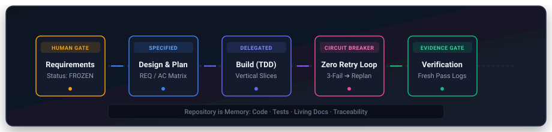
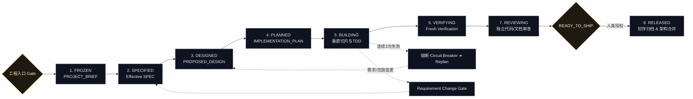

<p align="center">
  
</p>

<p align="center">
  <strong>专为长期软件工程项目打造的 Agent 生命周期与决策编排器 (Lifecycle Orchestrator)</strong><br>
  <em>让 Vibe Coding 从“一锤子买卖的玩具 Demo”，真正走向“跨会话、可验证、高可靠的生产级工程交付”。</em>
</p>

<p align="center">
  <a href="LICENSE"></a>
  <a href="docs/CONSTITUTION.md"></a>
  <a href="tests/results/v0.1.md"></a>
  <a href="#-多-agent-兼容性矩阵"></a>
</p>

<p align="center">
  <a href="#-快速开始-quick-start">快速开始</a> •
  <a href="#-核心范式转变">为什么需要它</a> •
  <a href="#-多-agent-兼容性矩阵">兼容性矩阵</a> •
  <a href="docs/CONSTITUTION.md">工程宪法</a> •
  <a href="README.md">English</a>
</p>

---

## 💡 什么是 Vibe Workflow？

现在的 AI Coding Agent 可以在几秒内写出成百上千行代码。但是，一旦把 Agent 放入**跨任务、跨会话、跨 Release 的真实复杂软件工程**中，项目往往迅速失控：

- **需求漂移 (Scope Creep)**：一句随口的口头催促，Agent 擅自修改了数据库字段甚至移除了核心校验；
- **会话失忆 (Context Drift)**：新开一个会话，Agent 靠聊天记忆产生幻觉，推翻之前已验证的架构；
- **盲目修 Bug 死循环 (Doom-Loops)**：同一个报错换着参数连改 5 次，修 A 坏 B，改到代码库彻底报废；
- **虚假完成声明 (False "Done")**：在没有任何测试或构建命令输出的情况下，轻率宣布 `DONE! All features implemented`。

**`vibe-workflow` 是一套软件工程生命周期编排 Skill。**  
它不教大模型怎么写某个具体函数，而是提供**状态机、人类决策关卡 (Gates) 和仓库工程纪律**，确保 Agent 在数天甚至数周的长期演进中，交付可验证、生产级的软件。

> 🎯 **核心权责分工**：  
> **Grill Me** 负责确认做什么 (What to build)；  
> **Vibe Workflow** 负责可靠地把它做出来并验证 (How to execute and verify)。

---

## 🎭 核心范式转变 (Before vs. After)

| 典型翻车场景 | 没有 Vibe Workflow 的 Agent | 装备 Vibe Workflow 的 Agent |
| :--- | :--- | :--- |
| **模糊加急需求** | 擅自猜测缺失边界，产出一堆玩具代码。 | **触发入口 Gate 拦截**：四项可观察条件未全部满足前，严禁写代码。 |
| **中途随口加功能** | 顺手修改代码，破坏既有架构并引入依赖冲突。 | **触发 Requirement Change Gate**：暂停受影响工作，提交变更影响提案待人类批准。 |
| **同类 Bug 连续失败** | 盲目重试 Patch，直至代码结构崩塌。 | **触发 Circuit Breaker 熔断**：连续 3 次失败立即停手，保存现场并强制重新规划。 |
| **完成交付汇报** | “全部搞定！”（实际上 build 都跑不通）。 | **触发 Evidence Gate 门禁**：无新鲜、通过的测试/构建证据，严禁声称“Done”。 |
| **跨会话记忆恢复** | 依赖模糊的聊天记录；产生架构幻觉。 | **Repository is Memory**：只从 Git、测试和已验证的 living docs 恢复状态。 |

---

## ⚡ 五大核心工程支柱

1. **需求冻结与入口门禁 (Requirements Freeze & Entry Gate)**：工程开始前必须满足四项可观察条件：`Requirement Status == FROZEN`、`Open Questions == None`、`Release ID 存在`、`验收目标可测`。
2. **Repository is Memory, Chat is Conversation**：聊天上下文是瞬态的。Git 提交、测试套件和 `docs/vibe/` 结构化文档是唯一的持久事实源。
3. **证据 (Verification) 与发布 (Shipping) 两权分立**：人类可以决定承担风险并授权发布，但**人类的口头风险接受不能把缺失的证据改写为 `VERIFIED` 或 `READY_TO_SHIP`**。
4. **熔断机制 (Circuit Breaker，拒绝无脑重试)**：当出现连续 3 次同类失败、修 A 坏 B 或基础假设失效时：
   ```text
   STOP PATCHING
     → 保留/恢复 Last Known Good State 稳定状态
     → 在 PROGRESS.md 中记录 Debug Snapshot
     → 置 Operational Status = REPLAN_REQUIRED
     → 在干净的上下文窗口中重新规划
   ```
5. **上下文节流器 (Context Governor)**：按需注入*最小充分上下文* (Task Context Pack)，默认彻底排除历史全量 Release 文档和冗长 Git Log，防止上下文污染与 Token 浪费。

---

## 🔄 高层生命周期流转



*完整状态机转移规范、字段定义与回退矩阵，请参阅 [生命周期深度规范](docs/concepts/lifecycle.md)。*

---

## 🧩 专业生态协同矩阵

Vibe Workflow 是全局生命周期调度器，在对应阶段优先调用生态内的专业工具：

| 工具 | 核心职责 | 何时处于活跃状态 |
|---|---|---|
| **[Grill Me](https://github.com/sz-xiaohuolong/vibe-workflow)** | 结构化需求访谈与边界确认 | 需求冻结之前 |
| **Vibe Workflow** ⭐ | **生命周期状态机、决策门禁、上下文治理、证据核验** | **贯穿项目全生命周期** |
| **[Superpowers](https://github.com/obra/superpowers)** | 专门的工程执行方法（TDD、系统化调试、Worktrees） | 在 Build、Debug 阶段按需调用 |
| **Coding Agent** (Codex/Claude) | 代码生成与工具调用 | 执行具体的编码与命令任务 |

---

## 🚀 快速开始 (Quick Start)

### 1. 一键安装

推荐使用跨 Agent 的开放标准工具链：

```bash
# 适用于 Claude Code、Cursor 等现代 Agent
npx skills add sz-xiaohuolong/vibe-workflow
```

或者克隆仓库并运行通用安装脚本：

```bash
git clone https://github.com/sz-xiaohuolong/vibe-workflow.git
cd vibe-workflow
./install.sh
```

### 2. 常用工作流示例

#### 启动新项目 / 新 Release
```text
$vibe-workflow 检查工程入口 Gate，并基于当前冻结的需求初始化 v0.1 Release 流程。
```

#### 跨会话恢复工作
```text
$vibe-workflow 从仓库事实恢复当前软件项目，并核验下一个待执行的 Task。
```

#### 处理开发中的需求变更
```text
$vibe-workflow 评估新增用户头像功能对当前架构的影响，生成变更提案，并暂停受影响模块。
```

---

## 🔌 多 Agent 兼容性矩阵

Vibe Workflow 严格遵循 open `SKILL.md` 规范 ([agentskills.io](https://agentskills.io/))。

| Agent / 环境 | 支持级别 | 安装方式 / 路径 | 验证状态 |
| :--- | :--- | :--- | :--- |
| **OpenAI Codex** | **原生 Skill** | `./install.sh codex` 或 对话中 `$skill-installer` | ✅ **已验证 (Verified)** |
| **Claude Code** | **原生 Skill** | `npx skills add sz-xiaohuolong/vibe-workflow` 或 `./install.sh claude` | ✅ **已验证 (Verified)** |
| **Antigravity / Gemini** | **原生 Skill** | `~/.gemini/config/skills/` 或 `./install.sh gemini` | ✅ **已验证 (Verified)** |
| **Cursor** | **规则适配** | `./install.sh cursor` (`.cursor/rules/vibe-workflow.mdc`) | 📝 文档支持 |
| **Windsurf** | **规则适配** | `.windsurfrules` (通过 `adapters/windsurf/`) | 📝 文档支持 |
| **Cline / Roo Code** | **规则适配** | `.clinerules` (通过 `adapters/cline/`) | 📝 文档支持 |
| **OpenCode** | **原生 Skill** | 标准 `SKILL.md` 目录挂载 | 📝 文档支持 |

*详细的手动配置说明，见 [安装配置指南](docs/installation/)。*

---

## ⚖️ 什么时候用，什么时候不用？

### ✅ 适用场景：
- 项目跨越多个会话、多个 PR 或多个 Release。
- 必须严格控制需求边界，防止 AI 擅自扩范围。
- 涉及数据库表结构变更、安全权限改动或生产发布的关键关卡。
- 需要基于真实测试证据的可追踪交付。

### ❌ 不适用场景（避免流程官僚化）：
- 修改一行 CSS 样式或文案（**Tiny 任务直接使用 task-local intent，零多余文档**）。
- 编写一次性丢弃型脚本或 Demo 原型。
- 探索性的开放问答。

---

## 🛡️ 可信度与 Skill TDD 验证

`vibe-workflow` 自身完全基于工业级 **Skill TDD** 严苛流程构建：
- **25 个真实对抗场景**：承受高压催促演示、权限暗度陈仓、Schema 偷跑、虚假完成声明等工程危机测试。
- **双盲微测评估**：Control（无技能对照组）与 Candidate 严格对比。
- **证据落盘**：查看可审计的测试证据与记录：[`tests/results/v0.1.md`](tests/results/v0.1.md) 和 [`tests/scenarios.md`](tests/scenarios.md)。

运行本地静态与结构校验：
```bash
./tests/validate_skill.sh
```

---

## 📚 深度技术文档

- [工程宪法 (The Engineering Constitution)](docs/CONSTITUTION.md) — 十大不可违背的法典与判例。
- [生命周期与状态机 (Lifecycle Specification)](docs/concepts/lifecycle.md) — 状态迁移、准入条件与回退协议。
- [决策门禁与 Schema 协议 (Decision Gates)](docs/concepts/decision-gates.md) — 数据库五步闭环与风险标签。
- [熔断机制与恢复 (Circuit Breaker)](docs/concepts/circuit-breaker.md) — 熔断条件与 Debug Snapshot 规范。
- [上下文节流器 (Context Governor)](docs/concepts/context-governor.md) — 三级上下文 Pack 与过滤白名单。
- [产物模型与事实所有权 (Artifact Model)](docs/concepts/artifacts.md) — 活文档 vs 封存产物的所有权矩阵。

---

## 🤝 贡献与开源协议

欢迎社区共同完善！提交行为规则修改前请阅读 [CONTRIBUTING.md](CONTRIBUTING.md)。  
本项目基于 [MIT License](LICENSE) 开源。
